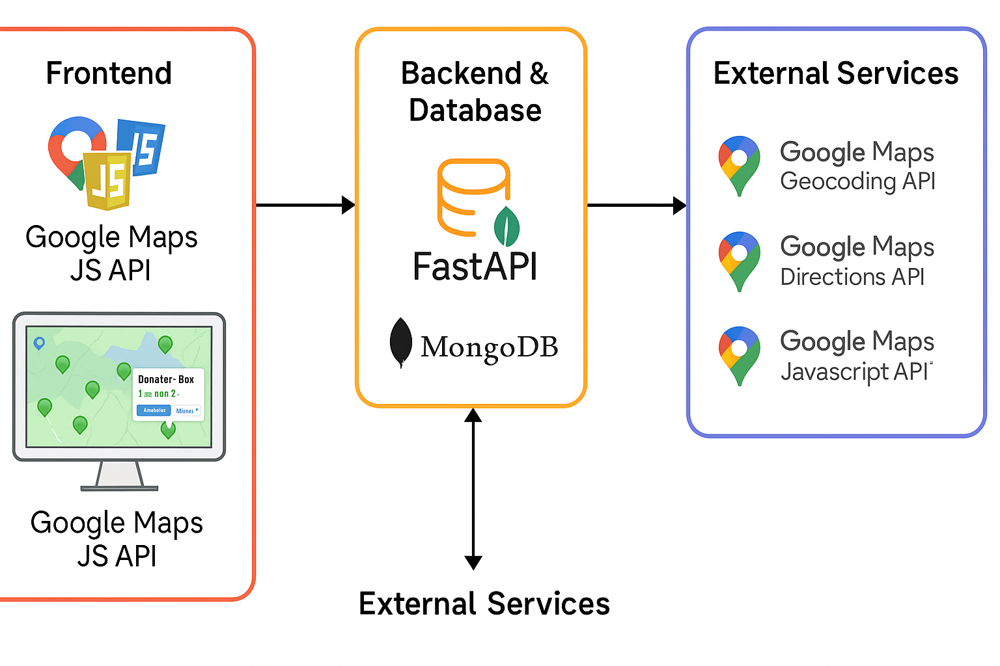

# 📍 PinBin – Community Donation Box Finder

**PinBin** is a Google Maps-powered web app that helps people locate and add nearby donation boxes, making giving easier and more accessible. Whether you're decluttering as a student or a community member looking to make a difference, PinBin helps you find the nearest drop-off spots for clothes, books, and more.

> Submitted for the **Google Maps Platform Award Hackathon**

---

## Inspiration

We call Earth our home — yet so many around us are homeless or in need. At the same time, students and residents throw away items that could be reused. **PinBin** bridges this gap by helping people **easily locate donation drop boxes**, especially from organizations like *Goodwill*, *Pickup Please*, and more. It's our way of encouraging sustainable living through micro-acts of kindness.

---

## How It Works

- Interactive **Google Map** to display and add pins for donation boxes.
- Click anywhere to open a modal and **add a donation box** with name & organization.
- Pins are stored in a **backend database** (FastAPI hosted on Render/ngrok).
- All saved boxes are shown as green markers on the map every time you load it.
- Clicking a pin shows its name, address (via reverse geocoding), and a **Directions + Donate** popup.

---

## Tech Stack

- **Frontend**: HTML, CSS, JavaScript, Google Maps JS API
- **Backend**: FastAPI (hosted on Render/ngrok)
- **Database**: MongoDB (storing location, name, org)
- **APIs Used**:
  - Google Maps JavaScript API
  - Google Maps Geocoding API
  - Google Maps Directions API

---

## Architecture

---

## Demo Video

🎥 [Watch the demo on YouTube](https://youtu.be/KMoVsqI8cbk)

---

## Impact

- Reduces landfill waste by redirecting usable items.
- Empowers students and residents to donate responsibly.
- Removes guesswork in finding drop boxes.
- Makes communities more connected and sustainable.
   git clone https://github.com/your-username/pinbin.git
   cd pinbin/client
